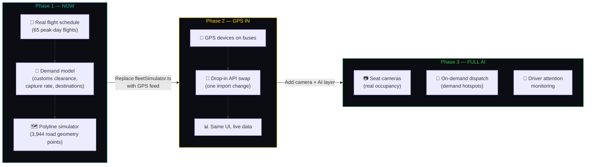
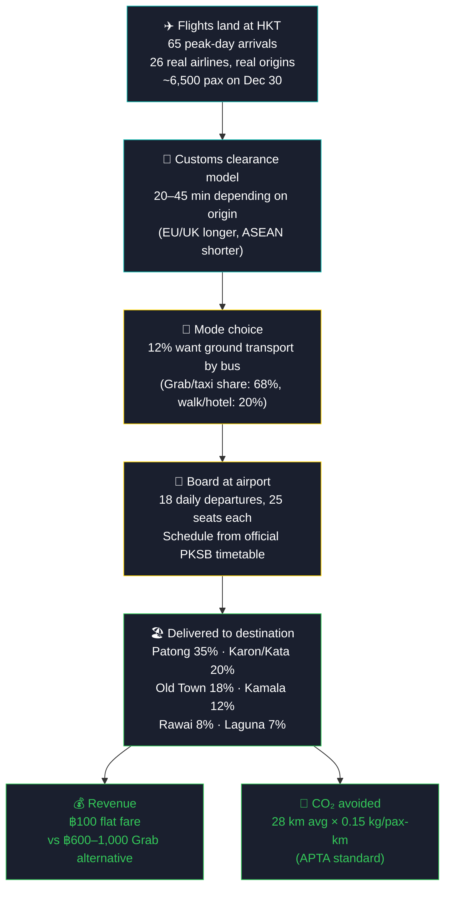
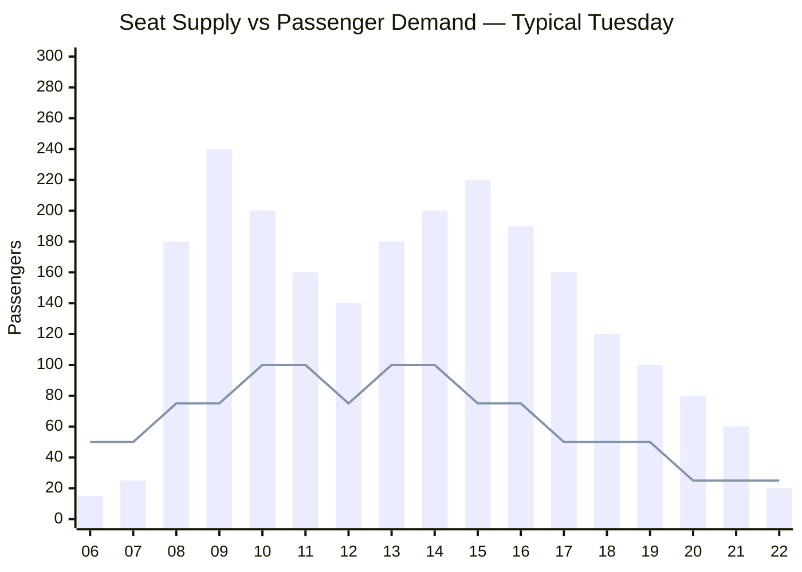
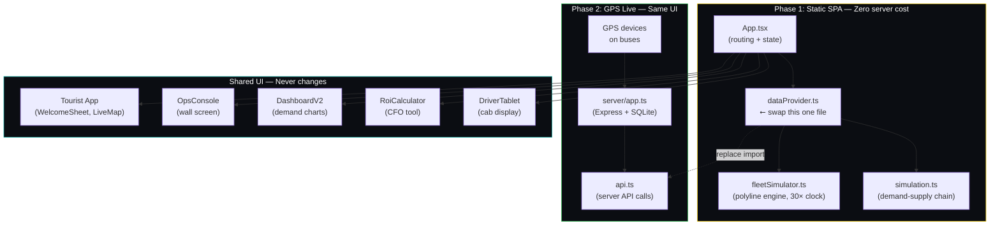
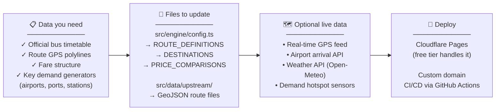

# Phuket Smart Bus — Operations Intelligence Platform


[](https://bus.nonarkara.org)
[](https://bus.nonarkara.org/roi)
[](src/engine/regression.test.ts)
[](tsconfig.json)
[](https://nonarkara.org)

**AI-powered operations intelligence, demand forecasting, route analysis, and real-world ROI modeling for public transit — built as a simulation that becomes a live system the moment GPS goes in.**

> *Move Phuket Smarter. See The System. Price The Future.*

---

## Live

| Surface | URL | Audience |
|---|---|---|
| Tourist App | [bus.nonarkara.org](https://bus.nonarkara.org) | Riders on their phones |
| Ops Console | [bus.nonarkara.org/ops](https://bus.nonarkara.org/ops) | Dispatchers, wall screens |
| Demand Dashboard | [bus.nonarkara.org/v2](https://bus.nonarkara.org/v2) | Management, investors |
| ROI Calculator | [bus.nonarkara.org/roi](https://bus.nonarkara.org/roi) | Bus company CFOs, city planners |
| Driver Tablet | [bus.nonarkara.org/driver/กข 1001 ภูเก็ต](https://bus.nonarkara.org/driver/%E0%B8%81%E0%B8%82%201001%20%E0%B8%A0%E0%B8%B9%E0%B8%81%E0%B9%87%E0%B8%95) | Bus drivers |
| Pitch Demo | [bus.nonarkara.org/?demo=tuesday](https://bus.nonarkara.org/?demo=tuesday) | Conferences, boardrooms |

---

## The Core Idea

This system solves a chicken-and-egg problem that kills most transit tech projects:

> *You can't get funding without showing how the system works. You can't show how the system works without funding to build it.*

The answer: **build the full production system first, feed it simulated data, make it indistinguishable from live operations, then swap in real GPS when the buses are ready.**

Every number on screen — riders, revenue, CO₂ saved, wait times, route profitability — is computed from a real demand model, not hardcoded. Swap one import and the simulation becomes live telemetry.

---

## Three Phases, One Codebase



The TypeScript types for Phase 3 are already defined in `shared/types.ts`. The ingest endpoints already exist in `server/app.ts`. Nothing about Phase 3 requires rewriting Phase 1.

---

## The Demand-Supply Chain

Every metric traces back to this chain. If a number can't be traced here, it doesn't appear on screen.



---

## Six Surfaces, One Platform

### Tourist App — `/`

The phone-first rider experience. iOS-inspired, 6 languages, live bus positions updated every second at 30× time acceleration so a visitor sees a full day unfold in minutes.

- Countdown to next bus (mm:ss, ticks 5× per second)
- Fare comparison vs Grab and tuk-tuk
- Route switching via pill tabs
- Bottom sheet booking flow
- Works at 360px viewport without horizontal scroll

**Languages:** EN · TH · ZH · DE · FR · ES

---

### Ops Console — `/ops`

The 50″ wall screen view for dispatchers and operations managers. Dark theme, three-column grid, real-time accumulating metrics.

```
┌─────────────────────┬──────────────────────┬─────────────────────┐
│   DEMAND            │      LIVE MAP        │   SUPPLY            │
│                     │                      │                     │
│ ✈ Flights landed    │  [Phuket island      │ Buses: 17 active    │
│ 14 arrivals         │   with moving        │ On time: 67%        │
│ 3,490 pax today     │   bus markers]       │ Revenue: ฿17,200    │
│                     │                      │                     │
│ 📊 Regional origins │                      │ 🌿 CO₂: 722 kg      │
│ SE Asia ████ 42%    │                      │    saved today      │
│ China   ███  28%    │                      │                     │
│ Russia  ██   16%    │                      │ ⚡ Next departure   │
│ Europe  █    8%     │                      │    in 3 min         │
└─────────────────────┴──────────────────────┴─────────────────────┘
      RIDERS     TRIPS     KM RUN    PAX      REVENUE    CO₂
      206,408    34,120    1,190    172 pax   ฿17,200   722 kg
                    ↑ accumulates in real time, all day ↑
```

---

### Demand Dashboard — `/v2`

Schedule-driven supply vs real demand, per hour, across all routes. Answers the operator question: *"Where are we leaving money on the table?"*



*When the bar exceeds the line: buses full, riders left behind. That gap is revenue waiting to be captured.*

---

### ROI Calculator — `/roi`

Three sliders. Every assumption sourced. Built for the bus company CFO who will poke at it and ask hard questions.

| Input | Range | Default |
|---|---|---|
| Fleet size | 10 (pilot) → 80 (full island) | 20 buses |
| Bus capture rate | 5% (today) → 35% (Singapore-class) | 12% |
| Average fare | ฿50 (subsidised) → ฿150 (premium) | ฿100 |

**At defaults (20 buses, 12% capture, ฿100 fare):**

| Metric | Annual |
|---|---|
| Riders | ~190,000 |
| Revenue | ฿19.0M |
| Operating cost | ฿16.8M (fuel + drivers + maintenance) |
| **Profit** | **฿2.2M** |
| Payback on ฿5M capex | **~27 months** |
| CO₂ avoided | ~800 tonnes |
| Grab-equivalent saved for riders | ฿136M |

Every line item in the cost model has a `[SRC]` tag the CFO can tap to see the source (PKSB tariff schedule, APTA standards, Grab quoted rates).

---

### Driver Tablet — `/driver/[plate]`

Per-bus operational display. Built for a 10″ tablet mounted in the cab.

```
┌──────────────────────────────────────────────────────────┐
│ PKSB DRIVER          ROUTE              09:14             │
│ กข 1001 ภูเก็ต      Bus to Airport     BKK               │
├──────────────────────────────────────────────────────────┤
│                                                          │
│              NEXT STOP                                   │
│         Andaman Cannacia Resort                          │
│           อันดามัน คาเนเซีย                             │
│                                                          │
│                  ┌─────────┐                             │
│                  │    8    │ min                         │
│                  └─────────┘                             │
│                                                          │
├──────────────┬──────────────┬────────────┬───────────────┤
│ ON-TIME      │ PASSENGERS   │ SPEED      │ WEATHER       │
│ +3m ahead    │ 20 / 25      │ 16 km/h    │ 30° Light rain│
├──────────────┴──────────────┴────────────┴───────────────┤
│ UPCOMING STOPS                            24 ahead       │
│  1  Rawai Beach · หาดราไวย์                          ✓  │
│  2  Sai Yuan · ไสยวน                                ✓  │
│▶ 3  Andaman Cannacia Resort                       6m    │
│  4  Beyond hotel Kata                             9m    │
│  5  Kata Palm                                    10m    │
└──────────────────────────────────────────────────────────┘
```

When GPS telemetry is connected, the ETA countdown becomes live. The data layer (`dataProvider.ts`) is the only file that changes.

---

### Auto-Play Pitch Demo — `/?demo=tuesday`

A scripted, narrated walkthrough of a Tuesday operation — flights landing, buses filling, demand charts rising — with caption cards advancing automatically. Built for conferences and boardroom projector screens. No presenter required.

---

## Architecture: Simulation → Production



The production backend (`server/`) is already written. It has:
- Real GPS telemetry ingest endpoints (`/api/integrations/vehicle-telemetry`)
- SQLite persistence for vehicle history
- 15-second snapshot background worker
- Live bus API integration (`smartbus-pk-api.phuket.cloud`)
- Seat camera, driver attention, and passenger flow ingest endpoints

It's just not deployed yet. When the buses get GPS devices, it deploys.

---

## Real Data Sources

| Data | Source | Status |
|---|---|---|
| Bus timetable | Official PKSB schedule (effective 18 Jan 2025) | ✅ Hardcoded |
| Flight schedule | 65 peak-day flights, real airlines & origins | ✅ Hardcoded |
| Route polylines | 3,944 GPS points of actual road geometry | ✅ Bundled GeoJSON |
| Ferry schedules | phi-phi.com + pier websites | ✅ Hardcoded |
| Pricing | 2025 Phuket market rates (Grab, taxi, tuk-tuk) | ✅ Sourced in code |
| CO₂ model | APTA standard: 0.15 kg/pax-km bus, 0.21 car | ✅ Cited |
| Weather | Open-Meteo API | ✅ Live in server |
| Live bus positions | PKSB GPS (smartbus-pk-api.phuket.cloud) | ⏳ Phase 2 |
| Seat occupancy | On-bus cameras | ⏳ Phase 3 |

---

## Routes Covered

### Land Routes

| Route | Direction | Daily Trips | Trip Time | Fare |
|---|---|---|---|---|
| Airport Line (Rawai–Airport) | Both | 20 outbound / 25 inbound | 95 min | ฿100 |
| Patong Line | Loop | 15 | 35 min | ฿100 |
| Dragon Line | Loop | 8 | 50 min | ฿100 |
| Orange Line (competitor) | Airport–Town | 10 | 80 min | ฿100 |

### Ferry Routes

| Route | Departures | Duration |
|---|---|---|
| Rassada → Phi Phi | 5/day | ~2 hr |
| Rassada → Ao Nang | 1/day | ~2 hr |
| Bang Rong → Koh Yao Noi | 4/day | ~40 min |
| Chalong → Racha | 2/day | ~35 min |

---

## Fleet Roster

```
Land Buses (20 vehicles)
  Airport Line:  กข 1001 – กข 1010  (10 buses, 25 seats)
  Patong Line:   กค 2001 – กค 2007  (7 buses, 25 seats)
  Dragon Line:   กง 3001 – กง 3003  (3 buses, 15 seats)

Ferries (13 named vessels)
  Rassada route: MV Andaman Princess, MV Koh Phi Phi Express, ...
  Bang Rong route: Speedboat (x2)
  Chalong route: Speedboat (x2)

Competitor (simulated)
  Orange Line:   OL 8411-A – OL 8411-C (3 buses, Gov.)
```

---

## Deploy This For Your City

This platform is designed to be replicated. Here's what you need:



### City Replication Checklist

- [ ] Replace `DESTINATIONS` array with your city's demand points + traveller share
- [ ] Replace timetable JSON files (`airport-rawai.json` etc.) with your schedules
- [ ] Replace GeoJSON polylines in `src/data/upstream/` with your road traces
- [ ] Update `ROUTE_DEFINITIONS` in `config.ts` with your route names and metadata
- [ ] Update `PRICE_COMPARISONS` with local taxi/rideshare rates
- [ ] Set `BUS_CAPTURE_RATE` to your realistic baseline (12% for Phuket)
- [ ] Update fleet roster in `fleetSimulator.ts` with local vehicle plates
- [ ] Translate `src/lib/i18n.ts` strings for your target languages
- [ ] Deploy to Cloudflare Pages — works on free tier

**Time to first demo for a new city: 2–3 days of data entry + 1 day of configuration.**

The logic, the simulation engine, the ROI calculator, the driver tablet, and the ops console all carry over unchanged. Only the data changes.

---

## Tech Stack

```
Frontend
  React 19 + TypeScript (strict)
  Vite 6 + Tailwind CSS v4
  Leaflet (map with imperative vehicle markers)
  GeoJSON route data (bundled, no external tile dependency)

Simulation Engine
  Pure TypeScript, no runtime deps
  Polyline interpolation with binary search (O(log n) per tick)
  30× time acceleration + fractional minutes (smooth animation)
  Memoised hourly metrics (computed once, not every tick)

Production Backend (ready, not deployed)
  Express + TypeScript
  SQLite (vehicle history, telemetry snapshots)
  Background worker (15-second GPS snapshot cadence)
  REST ingest: GPS telemetry, seat cameras, driver attention, pax flow

Deploy
  Cloudflare Pages (frontend) — free tier
  Render (backend, when Phase 2 activates)
  GitHub Actions CI (typecheck + 63 tests before every deploy)
```

---

## Why This Approach Is Different

Most transit dashboards are built backwards: wire up the data first, design the UI later, discover that the data is incomplete, spend 18 months in procurement. This one starts from the user experience and works backwards to the data.

| Traditional approach | This approach |
|---|---|
| Wait for GPS hardware → then build UI | Build full UI → hardware plugs in |
| Static mockups for investor pitch | Live simulation for investor pitch |
| Custom code per city | Config-driven, city is just data |
| Backend-heavy, expensive to run | Static SPA, ฿0/month until GPS phase |
| 6–24 months to first demo | 2–3 days to first demo for new city |
| One language | 6 languages (EN TH ZH DE FR ES) |

---

## Quality Gates

Every commit to `main` runs:

```
npx tsc --noEmit          # Strict TypeScript — zero errors
npm test                  # 63 tests across 5 test suites
npx vite build            # Full production bundle
```

The deploy is blocked if any gate fails.

### Test Coverage

| Suite | Tests | What it guards |
|---|---|---|
| `regression.test.ts` | 10 | Polyline adherence, clock drift, fractional minutes, vehicle detail |
| `roi.test.ts` | 6 | ROI math, constant sourcing, currency formatting |
| `opsFlightSchedule.test.ts` | 4 | Flight schedule integrity, day-of-week fuzz |
| `persistence.test.ts` | 2 | SQLite re-hydration after memory reset |
| `App.test.tsx` | 2 | Tourist app tab switching |

---

## The Numbers (Peak Day Simulation)

```
Flights landing:    65 arrivals · ~6,500 pax
Cleared customs:    ~5,000 in the service window (06:00–22:30)
Want the bus:       ~600 (12% capture)
Actually board:     ~580 (limited by timetable capacity)
Delivered:          ~560 (some still in transit at end of day)

Revenue:            ฿56,000 (peak day)
vs Grab equivalent: ฿403,000 (what they'd have paid)
Rider savings:      ฿347,000 in a single peak day

CO₂ avoided:        ~840 kg vs full-taxi equivalent
```

---

## Presented At

- **GITEX AI Asia Singapore 2026** — Live simulation on a 60″ screen, no presenter required. The auto-play demo ran for 4 hours straight.

---

## Getting Started

```bash
git clone https://github.com/nonarkara/phuket-smart-bus.git
cd phuket-smart-bus
npm install
npm run dev          # Tourist app at localhost:5173/
                     # Ops console at localhost:5173/ops
                     # ROI calculator at localhost:5173/roi
                     # Driver tablet at localhost:5173/driver/กข%201001%20ภูเก็ต
```

To build for production:

```bash
npm run build        # Runs tsc + vite build
cp dist/client/index.html dist/client/404.html   # SPA routing fallback
```

---

## Project Structure

```
src/
├── App.tsx                     # Entry: routing, data polling
├── DashboardV2.tsx             # Demand-supply intelligence (/v2)
├── engine/
│   ├── simulation.ts           # The demand-supply chain (source of truth)
│   ├── fleetSimulator.ts       # Vehicle positioning + schedule supply
│   ├── dataProvider.ts         # ⭠ swap this for GPS (Phase 2)
│   ├── roi.ts                  # ROI math with sourced constants
│   ├── config.ts               # Routes, pricing, destinations
│   ├── routes.ts               # GeoJSON loader
│   ├── flightData.ts           # 65 peak-day flights
│   └── regression.test.ts      # 10 regression tests
├── components/
│   ├── OpsConsole.tsx          # Wall screen dashboard
│   ├── RoiCalculator.tsx       # CFO tool
│   ├── DriverTablet.tsx        # Cab display
│   ├── LiveMap.tsx             # Leaflet + imperative markers
│   ├── WelcomeSheet.tsx        # Tourist bottom sheet
│   └── DemoCaption.tsx         # Auto-play narration
├── lib/
│   ├── i18n.ts                 # 6-language strings
│   └── vehicleAnimation.ts     # CSS transition helpers
└── data/upstream/
    ├── rawai_airport_line.json  # 3,944-point road polyline
    └── [other route GeoJSON]

server/                         # Production backend (Phase 2)
├── app.ts                      # Express + 30+ API endpoints
├── services/
│   ├── providers/              # GPS, weather, AQI, seat camera
│   └── persistence.ts          # SQLite vehicle history
└── [ready, not deployed]

shared/
└── types.ts                    # Shared TypeScript types (Phase 1–3)
```

---

## License

MIT. Fork it, adapt it, deploy it for your city.  
If you deploy this for a real transit system, I'd love to hear about it.

---

**Built by [Dr. Non Arkara](https://nonarkara.org) — architect, urbanist, and recovering academic who got tired of waiting for the government to move faster than a Phuket tuk-tuk.**

*Built in Thailand. Designed for real operations.*
