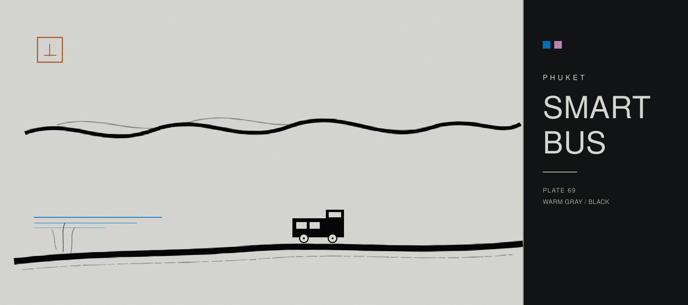
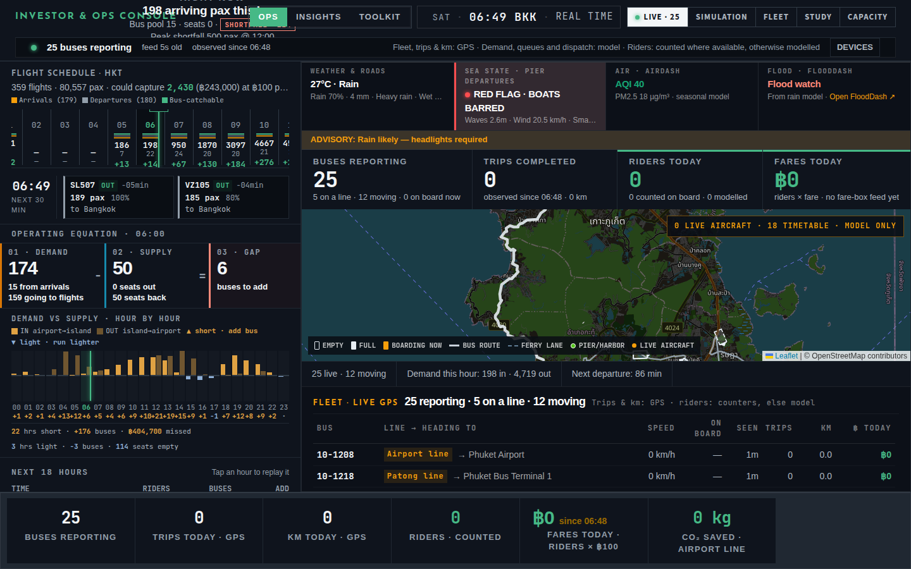
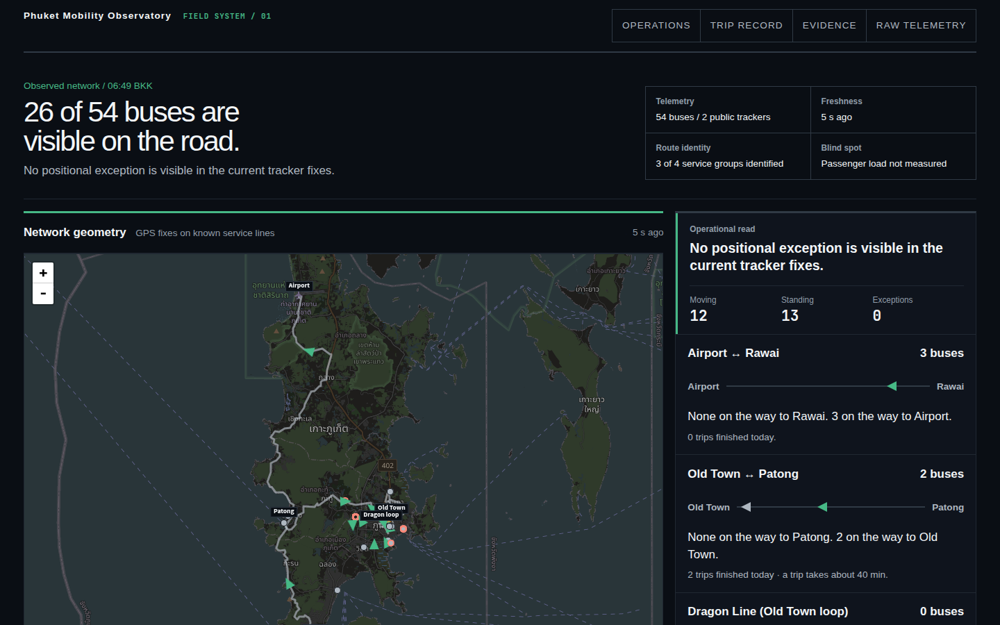
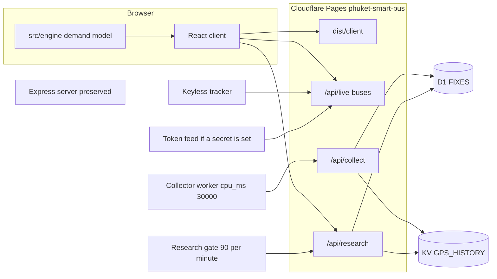
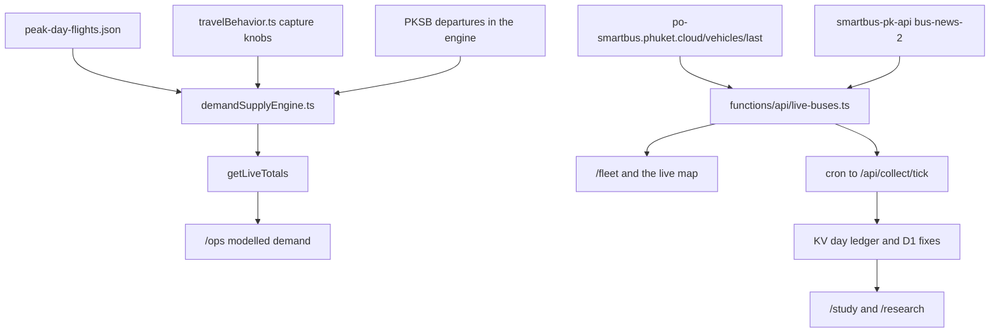

*Original drawing. Brush, paper grain, and the empty field carry the mood; the colours are Palette tokens (see [CREDITS.md](CREDITS.md)). The bus is not a GPS report, and nothing in the picture is a live count.*

**A Phuket bus operations prototype: public-tracker positions on one side, a conserved demand model on the other, labelled so they are not the same thing.**

[](https://github.com/Nonarkara/phuket-smart-bus/actions/workflows/ci.yml)
[](https://bus.nonarkara.org)
[](.github/workflows/ci.yml)
[](LICENSE)

Live demo: **[bus.nonarkara.org](https://bus.nonarkara.org)** · operations wall: **[/ops](https://bus.nonarkara.org/ops)**

This is an independent studio prototype. It is not a Phuket Provincial Administration product, not an official Phuket Smart Bus passenger-information system, and not a certificate that the US-ASEAN toolkit archive inside the repo is an agency deployment.

## Screenshots

Captured from the live site. The figures move. A later visit will not match these pixels. Modelled demand on `/ops` is the engine; positions on `/fleet` are the tracker.

| Operations wall (`/ops`) | Fleet console (`/fleet`) |
|---|---|
|  |  |

## What it does, and who it is for

Two audiences, one codebase.

1. **Riders**, on a phone — where the next bus is, when it arrives, and how the fare compares with a taxi or Grab.
2. **Operators and the owner**, on a wall screen that also works on a phone — where the buses are, what the timetable can carry, and where a modelled queue and the scheduled seats do not meet.

The public site is a Cloudflare Pages app. Pages Functions relay the public tracker, a KV namespace keeps daily summaries, and a D1 database keeps distinct fixes. Passenger demand, queues, dispatch advice, fares derived from modelled riders, and CO₂ are model outputs. A fresh GPS fix does not turn a modelled passenger into an observed one.

| Surface | Path | Who it is for |
|---|---|---|
| Rider front door | [`/`](https://bus.nonarkara.org/) on `bus.nonarkara.org` | Phone: passenger app. Wide window: desktop shell. |
| Studio hub | [`/`](https://bus.nonarkara.org/) on any other host, and [`/toolkit`](https://bus.nonarkara.org/toolkit) everywhere | Research archive and the US-ASEAN method notes |
| Operations wall | [`/ops`](https://bus.nonarkara.org/ops) | Dispatch and the owner |
| Same wall, older URL | [`/v2`](https://bus.nonarkara.org/v2) | `DashboardV2`, same component as `/ops` |
| Capacity | [`/capacity`](https://bus.nonarkara.org/capacity) | Live fleet beside modelled demand |
| Fleet | [`/fleet`](https://bus.nonarkara.org/fleet) | One strip per line, map, buses that need a look |
| Every tracker field | [`/fleet/raw`](https://bus.nonarkara.org/fleet/raw) | Sort, filter, export |
| Study | [`/study`](https://bus.nonarkara.org/study) | Day and week archive |
| Research | [`/research`](https://bus.nonarkara.org/research) | Trips, headways, time–distance diagram |
| ROI | [`/roi`](https://bus.nonarkara.org/roi) | Fare, fleet, and capture sliders over sourced constants |
| Governor | [`/governor`](https://bus.nonarkara.org/governor) | Impact framing |
| Driver tablet | [`/driver/กข 1001 ภูเก็ต`](https://bus.nonarkara.org/driver/%E0%B8%81%E0%B8%82%201001%20%E0%B8%A0%E0%B8%B9%E0%B8%81%E0%B9%87%E0%B8%95) | One simulated bus |

`/?demo=tuesday` installs a scripted clock. It is the same model.

The Express app in `server/` is the production-shaped ingest and provider boundary. It is not what serves `bus.nonarkara.org`.

## Architecture


```mermaid
flowchart LR
  subgraph browser [Browser]
    UI[React client]
    Model[src/engine demand model]
  end
  subgraph pages [Cloudflare Pages phuket-smart-bus]
    Static[dist/client]
    Relay["/api/live-buses"]
    Collect["/api/collect"]
    ResearchFn["/api/research"]
  end
  KV[(KV GPS_HISTORY)]
  D1[(D1 FIXES)]
  Keyless[Keyless tracker]
  Token[Token feed if a secret is set]
  Cron[Collector worker cpu_ms 30000]
  Gate[Research gate 90 per minute]
  Express[Express server preserved]

  UI --> Static
  Model --> UI
  UI --> Relay
  UI --> ResearchFn
  Keyless --> Relay
  Token --> Relay
  Cron --> Collect
  Collect --> KV
  Collect --> D1
  Gate --> ResearchFn
  ResearchFn --> D1
  ResearchFn --> KV
```

The Express process is drawn apart from Pages on purpose. Local `npm run dev` runs it. The public hostname does not.

## Data flow

The two chains meet on some screens. They are not merged into one fact.


```mermaid
flowchart TD
  Fixture["peak-day-flights.json"]
  Capture[travelBehavior.ts capture knobs]
  Timetable[PKSB departures in the engine]
  Engine[demandSupplyEngine.ts]
  Totals[getLiveTotals]
  Ops["/ops modelled demand"]

  Keyless[po-smartbus.phuket.cloud/vehicles/last]
  TokenFeed[smartbus-pk-api bus-news-2]
  Relay[functions/api/live-buses.ts]
  Fleet["/fleet and the live map"]
  Tick["cron to /api/collect/tick"]
  Store[KV day ledger and D1 fixes]
  Study["/study and /research"]

  Fixture --> Engine
  Capture --> Engine
  Timetable --> Engine
  Engine --> Totals --> Ops
  Keyless --> Relay
  TokenFeed --> Relay
  Relay --> Fleet
  Relay --> Tick --> Store --> Study
```

## Tech stack

| Layer | What is in the tree |
|---|---|
| Client | React 19, TypeScript, Vite 6, Leaflet. Routes and stops are GeoJSON saved as `.json` under `src/data/upstream/`. |
| Model | Pure TypeScript in `src/engine/`: `demandSupplyEngine.ts`, `simulation.ts`, `fleetSimulator.ts`, `opsFlightSchedule.ts`, `travelBehavior.ts`, `liveOps.ts`. |
| Edge | Cloudflare Pages Functions in `functions/api/`. Shared parser: `shared/pksbFeed.ts`. |
| Record | KV binding `GPS_HISTORY`. D1 binding `FIXES` (`migrations/0001_fixes.sql`). |
| Workers | `workers/collect.ts` (minute cron), `workers/researchGate.ts` (rate limit), `cloudflare/toolkit-domain-router.ts` (host rewrite for the toolkit domain). |
| Server | Express in `server/`. Demo mode by default. SQLite and optional Postgres/Redis adapters stay in the tree for a later operator deploy. |
| Tests | Vitest on pull requests. Playwright specs in `e2e/` are a separate script. |

Passenger strings live in `src/lib/i18n.ts` for English, Thai, Chinese, Korean, German, French, and Spanish. The operations components under `src/components/v2/` do not import that catalog; that wall is English in source.

## Quickstart

```bash
git clone https://github.com/Nonarkara/phuket-smart-bus.git
cd phuket-smart-bus
npm ci
npm run dev
```

Open [http://localhost:4173/](http://localhost:4173/). You do not need an env file for demo mode.

| Command | What it does |
|---|---|
| `npm run dev` | Vite on port 4173, Express watcher, worker watcher |
| `npm run dev:web` | Vite only |
| `npm test` | Vitest, the suite CI runs |
| `npm run typecheck` | App, server, and test projects |
| `npm run build:client` | Client bundle to `dist/client/` |
| `npm run verify` | Typecheck, unit tests, full build, Playwright |

CI (`.github/workflows/ci.yml`) is Node 20, `npm ci`, `npm run typecheck`, `npm test`. It does not run Playwright.

A GitHub Pages project-site build:

```bash
GITHUB_PAGES=true npm run build:client
cp dist/client/index.html dist/client/404.html
```

That sets the Vite base to `/phuket-smart-bus/`. The hostname that actually serves riders is the Pages project, not GitHub Pages. `deploy.yml` publishes GitHub Pages; `public/CNAME` names `bus.nonarkara.org`, and that name is bound to Cloudflare Pages.

## Configuration

Copy `.env.example` to `.env` when you need to set a name. Values stay out of git. `.gitignore` ignores `.env` and `.env.*`, with an exception for `.env.example`.

| Name | Who reads it | Empty means |
|---|---|---|
| `VITE_GISTDA_API_KEY` | Vite, baked into tile URLs | GISTDA tile URLs have no key |
| `GITHUB_PAGES` | `vite.config.ts` | Base path `/`. The string `true` uses `/phuket-smart-bus/` |
| `DATA_MODE` | `server/config.ts` | `demo`, unless the value is `live` |
| `PORT` | `server/index.ts` | `3001` |
| `DATABASE_URL`, `REDIS_URL` | Express persistence | Those adapters stay off |
| `CORS_ORIGINS` | Express | In demo mode, a missing list allows any origin |
| `SMARTBUS_BEARER_TOKEN` | Express live mode, and the Pages relay | Express `live` will not boot. The relay still serves the keyless feed, without line names |
| `PKSB_INGEST_API_KEY` | Express ingest | Required before `DATA_MODE=live` will boot |
| `OPEN_METEO_BASE_URL` | Express weather provider | `https://api.open-meteo.com/v1/forecast` |
| `SMARTBUS_KEYLESS_URL`, `SMARTBUS_FEED_URL` | Pages relay | Built-in tracker URLs in `shared/pksbFeed.ts` |
| `INGEST_TOKEN` | `POST /api/collect/gps` | The route answers that ingest is closed |
| `PLAYWRIGHT_PORT`, `API_PORT` | Playwright | `4173` and `3099` |

`DATA_MODE=live` throws `Missing required live-mode configuration: …` until both `SMARTBUS_BEARER_TOKEN` and `PKSB_INGEST_API_KEY` are set (`server/config.ts`).

Pages bindings are not env vars. `wrangler.toml` binds KV `GPS_HISTORY` and D1 `FIXES` for this deployment. A fork creates its own namespaces. Do not point a fork at these ids.

## Data sources

| Source | Used for | Credit and terms |
|---|---|---|
| Keyless tracker `https://po-smartbus.phuket.cloud/vehicles/last` | Live positions. The relay sends a `smartbus.phuket.cloud` Referer. | Public tracker behind the operator’s map. This repo does not grant you a licence to the feed. Plates and tracks stay the operator’s. |
| Token feed `https://smartbus-pk-api.phuket.cloud/api/bus-news-2/` | Optional line and destination text | Needs `SMARTBUS_BEARER_TOKEN`. Do not commit a token. The official site has shipped one in public JavaScript; that does not make it a value for this git history. |
| PKSB timetable, effective 18 January 2025 | Airport-line running time (95 minutes) and the departures the model boards | Recorded in `src/components/v2/fleetRows.ts` and `server/config.ts`. The schedule is the operator’s. Using it is not an endorsement. |
| `server/data/fixtures/peak-day-flights.json` | Demand. The file says airport HKT, date 2025-12-27, `totalFlights` 380: 190 arrivals and 190 departures. | A fixture in this repo, not a live airport feed. `opsFlightSchedule.ts` fuzzes it by weekday: 5% cancellation, ±15% passengers, ±10 minutes, plus the charter list in that file. |
| `src/engine/travelBehavior.ts` | Share of arrivals who join the bus queue, by origin region | Heuristics, stated as heuristics. Not a ridership census. |
| `src/engine/roi.ts` | `/roi` and the CO₂ factors the wall reuses | Each constant in that file names its source in a comment (APTA 2018 update for the CO₂ factors, and the other notes beside the numbers). |
| OpenStreetMap raster tiles | Basemap on the passenger map, the operations map, and the fleet map | © OpenStreetMap contributors. Data is [ODbL](https://www.openstreetmap.org/copyright). Tile use is subject to the [tile usage policy](https://operations.osmfoundation.org/policies/tiles/). |
| OpenTopoMap, RainViewer, NASA EOSDIS GIBS | Optional layers. Attribution strings in `src/engine/dataProvider.ts` and `DesktopSatelliteBackdrop.tsx` are `OpenTopoMap`, `RainViewer`, and `NASA EOSDIS GIBS`. | Those providers’ own terms. |
| GISTDA | Satellite tiles and PM2.5 when `VITE_GISTDA_API_KEY` is set (`src/engine/gistda.ts`) | Geo-Informatics and Space Technology Development Agency, Thailand. The key is for their rate limit. This repo does not attach an open-data licence to the imagery. |
| Open-Meteo | Weather and air quality in the Express providers | [open-meteo.com](https://open-meteo.com/). Their API documents [CC BY 4.0](https://creativecommons.org/licenses/by/4.0/) for the data. |
| Sanzo Wada combinations | Hero colours only | [CREDITS.md](CREDITS.md). MIT dataset, copyright © 2020 Matt DesLauriers. |

`data/pksb.sqlite3` `vehicle_history`, if you find a copy, is not real GPS. An older server stamped device ids onto simulated positions. Do not mine a route from it.

## Deploy

Production is Cloudflare Pages, project `phuket-smart-bus`, hostname `bus.nonarkara.org` (`public/CNAME`, `scripts/deploy.sh`). Confirm a response with `curl -sI https://bus.nonarkara.org/` and look for `server: cloudflare`.

The working manual path is `scripts/deploy.sh`. It builds the client, copies `index.html` to `404.html`, copies `functions/` into `dist/client/functions/` (Pages only runs Functions that ship inside the upload), deploys with Wrangler, then deploys the research gate and runs `scripts/verify-deploy.sh`.

```bash
scripts/deploy.sh
```

SPA routes are explicit `public/_redirects` rules that rewrite to `/` with status 200. A new top-level route in `src/App.tsx` needs a line there. There is no `/* /index.html 200` rule: Pages drops that as a loop, and a catch-all would also beat real files under `/assets`.

`.github/workflows/cloudflare-pages.yml` deploys on push to `main` with the repository secrets `CLOUDFLARE_API_TOKEN` and `CLOUDFLARE_ACCOUNT_ID`. The workflow file in the tree is the automation. Project notes record that this token has failed authentication (Cloudflare error 10000), which is why `scripts/deploy.sh` exists. This README does not re-test that secret.

`.github/workflows/deploy.yml` publishes GitHub Pages. That workflow is not what riders hit on `bus.nonarkara.org`.

## Cost guards

These are the caps in the repo, covered by `src/engine/cloudflareLimits.test.ts`.

| Guard | Where | What it does |
|---|---|---|
| Collector CPU | `wrangler.collector.toml` `[limits] cpu_ms = 30000` | Cloudflare’s ceiling for a minute cron. The worker fetches `/api/collect/tick` twice. The 30-second gap is a timer, not CPU. Observability logs are on. |
| Toolkit router CPU | `wrangler.toolkit.jsonc` `limits.cpu_ms = 50` | Host rewrite for `depa-usdot.nonarkara.org`. Logs on. |
| Research rate limit | `wrangler.research.toml`, `shared/researchLimit.ts` | 90 requests per 60 seconds per `cf-connecting-ip`. One `/research` view is the selected day plus a seven-day strip. Over the limit: HTTP 429 `{ "ok": false, "error": "rate_limited" }`. Missing or throwing binding on the gate worker: HTTP 503, and the origin is not fetched. |
| Pages and rate limits | `wrangler.toml` | Do not add a `[[ratelimits]]` binding there. `wrangler pages deploy` rejects that key. The binding lives on the research-gate worker, whose route is `bus.nonarkara.org/api/research/*`. |
| Express ingest | `server/config.ts` | Body limit `256kb`. Batch max 250 records. 60 requests per 60 seconds, HTTP 429 `rate_limited`. |

## How it works

A learner can ignore the chrome and read three decisions.

### 1. The queue conserves

`demandSupplyEngine.ts` builds one day as arrays indexed by minute. Scrubbing the clock reads those arrays. There is no second model for the “live” numbers.

Inbound: flights from the fixture, a customs ramp of 20–45 minutes (`CUSTOMS_MIN`, `CUSTOMS_MAX`), a capture rate from `travelBehavior.ts`, a FIFO curb queue, southbound departures that board up to `BUS_CAPACITY` (25). A passenger who waits past `ABANDON_AFTER_MIN` (60) leaves the queue and counts as lost. The fare constant is `FARE_THB` (100).

Return: a departing cohort has to be at the airport `CHECK_IN_LEAD_MIN` (60) before takeoff, bids onto the latest northbound trip that makes it, cascades earlier if that bus is full, and will not take a bus that arrives more than `MAX_EARLY_ARRIVAL_MIN` (180) early.

`getLiveTotals` is the money source of truth. Revenue is delivered passengers times ฿100, both directions added. Lost revenue is inbound abandoned plus return-leg lost, times the same fare. CO₂ uses `ROI_CONSTANTS`: 0.21 kg per passenger-km by car, 0.06 by bus, trip length 28 km (`src/engine/roi.ts`, reused in `simulation.ts`). The Grab comparison is the weighted destination fares in `simulation.ts` (the comment there records about ฿720).

Hour rows keep inbound and outbound separate. A netted gap hides an hour when one direction is short and the other is empty. That is why `HourlyCorridor` has `demandPax` and `outDemandPax`, not one combined gap. Ferries are not in that corridor: the comment in the engine says boats do not pick up the airport queue.

Capture rates in `BUS_CAPTURE_BY_REGION` are 7% SE Asia, 5% East Asia, 4% China, 5% India, 3% Russia/CIS, 3% Europe, 3% Middle East, 4% other. The file’s comment says a SE-Asia-heavy mix lands near 5%. They are knobs. The day an operator shares boarding counts, those eight numbers are what you edit.

### 2. The clock and the road are the picture

`getSimulatedMinutes()` in `fleetSimulator.ts` is the simulation clock. `SIM_SPEED` is 10: simulated minutes advanced per real minute. The on-screen chips are 1, 5, 15, and 30 (`SimulationControls.tsx`); 10 is the speed until a chip is pressed. The service window runs from 05:30 (`SERVICE_START`) and wraps at 24:00 so a long visit does not fall off the timetable. `DAY·60s` is a different speed: `DAY_SPEED` is 1020, so 05:30–22:30 plays in 60 real seconds and then pauses.

Buses follow the road geometry in `src/data/upstream/`. The airport line file `rawai_airport_line.json` has 7,881 coordinates. Position is a distance along that polyline, not a straight line between stops.

React-Leaflet `<Marker>` does not reliably move when `position` changes. The maps create an `L.marker` and call `setLatLng()`. The clock returns fractional minutes so two ticks in the same minute are not the same point.

### 3. Live positions stay live

One relay: `functions/api/live-buses.ts` polls into `liveOps.ts`. The keyless feed is the primary. The token feed is optional enrichment, joined on a normalised plate.

The keyless clock is not UTC. `GPSTime` / `RecvTime` are Bangkok wall time stamped as if they were Z. Trusting that stamp put every fix hours into the future. `resolveKeylessFixTime` picks the reading nearest the server receive time. `Speed` on that feed is tenths of a km/h.

A line is inferred in `decisiveLine`. A fix farther than `ON_LINE_M` (500 m) from every line is not a vote. If the next-nearest line is within `LINE_MARGIN_M` (250 m) of the nearest, the fix stays ambiguous, because Patong, Dragon, and the airport line share road. Two decisive votes (`LINE_VOTES`) assign the line. A terminal hit uses `TERMINAL_RADIUS_M` (400 m). A trip completes when the bus arrives at a terminal after covering at least half that line’s length since the last one (`pathSinceTerminalM >= line.lengthM * 0.5`). The feed itself has no line id.

When `paxOnBoard` is a number, the ledger can count boardings from rises. When it is null, `estimateTripRiders` may fill riders from the demand model and stores a basis string. Read that string before you quote the fare.

`VehiclePosition.telemetrySource` is `"public_tracker" | "direct_gps" | "schedule_mock"`. Replay positions are the third. Seat cameras, driver attention, and passenger-flow types in `shared/types.ts` are shapes for a later ingest. They are not evidence those devices are reporting.

## Fork it for your city

You can run this without Phuket’s hostnames, KV ids, or secrets.

1. `server/config.ts` and `src/engine/config.ts` — route ids, fares, competitor notes. The model’s airport fare and capacity are `FARE_THB` and `BUS_CAPACITY` in `demandSupplyEngine.ts`.
2. Timetable lists the simulator already reads (`getAirportDepartures`, `getAirportboundTrips` in `fleetSimulator.ts`).
3. Replace the GeoJSON under `src/data/upstream/`. Keep the `.json` extension.
4. Replace `BUS_CAPTURE_BY_REGION`, or delete the airport chain if you have no flights. Boat rows in the schedule do not feed the airport queue today.
5. `fleetSimulator.ts` — plates and the duty cycle. Keep `telemetrySource` honest. A polyline playback is `schedule_mock`.
6. `src/lib/i18n.ts` — passenger strings. The operations wall is a separate set of English literals.
7. Create your own Cloudflare project, KV namespace, and D1 database. Leave this repo’s ids in `wrangler.toml` behind.
8. Say, on the screen a rider will see, what is a tracker fix, what is a model, and who operates the buses.

`scripts/build-line-geometry.ts` rebuilds `shared/lineGeometry.json` after you change the lines the research page snaps to.

## Roadmap

These are gaps already visible in the code, not a promise of the next release.

- **Boats.** Ferry routes exist in the simulator and as `mode: "boat"` rows on some weekdays. `getHourlyCorridor` does not give them airport passengers.
- **Calibration.** The eight capture rates are the weakest constants in the money chain. They wait on observed boardings.
- **Counters.** A null `paxOnBoard` is not a counted zero. The ledger’s basis string is how you tell a count from a model fill.
- **i18n.** Passenger copy is a TypeScript catalog. The operations wall is English in the components. Splitting the catalog into JSON files is unfinished.
- **`/v2`.** It renders the same `DashboardV2` as `/ops`. The extra URL is still routed in `App.tsx` and `public/_redirects`.
- **Component tests.** The engine has the Vitest files under `src/engine/` and `server/`. React components are thinly covered. A verdict-chip test around `HourlyBalanceChart` is the one the project notes keep asking for.
- **CSS drift.** `src/styles.css` is large, and older class names remain for surfaces that were not restyled.

## FAQ

**Is this the official Phuket bus app?**
No. Tracker positions are only as fresh as the feed. Demand, queues, and fares from the model are labelled by how they were computed. Do not present the site as the operator’s passenger-information system.

**Can I run it with no keys?**
Yes. `npm ci` and `npm run dev`. Demo mode is the default. The keyless relay on a Pages deploy also needs no token; the token only adds line and destination labels.

**Why would live mode refuse to start?**
`DATA_MODE=live` requires `SMARTBUS_BEARER_TOKEN` and `PKSB_INGEST_API_KEY`. That is intentional. Demo mode does not.

**Why is a rider count sometimes null?**
The tracker field is null, or the screen is refusing to invent one. A rise in a real `PeopleCur` is a boarding in the ledger. A model fill is a different basis.

**Which backend is production?**
For `bus.nonarkara.org`, Pages Functions plus the collector and research-gate workers. `server/` is the Express boundary you would put in front of direct device GPS. The UI swap the project is built around is `src/engine/dataProvider.ts` toward `src/api.ts`, at the app boundary, when that feed exists.

**Does the hero show live buses?**
No. See the caption under the image and [CREDITS.md](CREDITS.md).

**What licence is the code under?**
`LICENSE` at the root is MIT, copyright © 2026 Non Arkaraprasertkul. Schedule text, tracker data, map tiles, photographs, and the *Vagabond* mood (inspiration only) are not covered by that grant. Read `LICENSE` before you redistribute.

## Contributing

Setup, branches, tests, and review rules: [CONTRIBUTING.md](CONTRIBUTING.md).

Behaviour: [CODE_OF_CONDUCT.md](CODE_OF_CONDUCT.md). Vulnerabilities: [SECURITY.md](SECURITY.md), in private.

Studio: [nonarkara.org](https://nonarkara.org) · [github.com/Nonarkara](https://github.com/Nonarkara)
